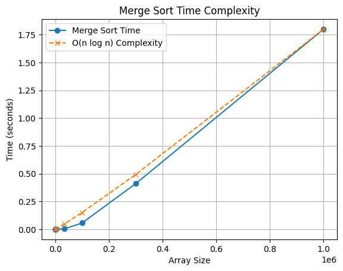
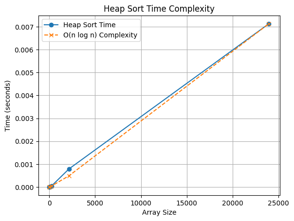

LAB-1(23 January 2025)
----------------------
QUES 1 ->  
AIM : To calculate the cosine similarity between two text files by analyzing word frequency and identifying common words.
WORKING : 1. Start  
          2. Read and Process Files:  
             - Open files and remove stop words.  
             - Store remaining words in a list.  
          3. Create Word Frequency Dictionaries:  
             - Count occurrences of each word and store them in a dictionary.  
          4. Find Common Words:  
             - Identify words present in both dictionaries.  
             - Multiply their frequencies and store in a new dictionary.  
          5. Compute Cosine Similarity:  
             - Compute magnitude of each dictionary:  sqrt [sum (freq[word] * freq[word])]
             - Compute dot product of common words.  
             - Calculate similarity: a.b / |a|*|b|  
          6. Print Cosine Similarity Value  
          7. Stop
        
OUTPUT :        Input -                                                                          Output - Cosine Similarity value: 0.875
                file 1 : Machine learning is a subset of artificial intelligence.
                file 2 : Machine learning, a branch of artificial intelligence.                                                  
                                              
TIME COMPLEXITY : O(n + m), n = len(file1) and m = len(file2)
SPACE COMPLEXITY : O(n+m)

QUES 2 ->  
AIM : To generate an n × n magic square, where the sum of each row, column, and diagonal is the same.
WORKING : 1. Start  
          2. Input: Read an odd integer n (size of the magic square).  
          3. Initialize:  
             - Create an n × n matrix filled with 0.  
             - Set starting position at the first row, middle column.  
          4. Place Numbers:  
             - For each number i from 1 to n²:  
               - Place i at the current position (row, col).  
               - Calculate new position:  
                 - Move up-left (row-1, col-1).  
                 - If out of bounds, wrap around.  
               - If the new position is occupied, move down instead.  
          5. Print Magic Square  
          6. Stop  
        
OUTPUT :        Input - Enter size (n x n): 3                                                             Output - Magic Square:
                                                                                                                    8 1 6
                                                                                                                    3 5 7
                                                                                                                    4 9 2                                               
                                              
TIME COMPLEXITY : O(n²)
SPACE COMPLEXITY : O(n²)

QUES 3 ->  
AIM : To find a peak element in a 1D array, where a peak is an element that is greater than its neighbors.
WORKING : 1. Start  
          2. Input: Read array size `n` and `n` elements.  
          3. Check Boundary Conditions:  
             - If first element is greater than the second, return index `0`.  
             - If last element is greater than the second last, return index `n-1`.  
          4. Binary Search for Peak:  
             - Compute `mid = (low + high) / 2`.  
             - If `arr[mid]` is greater than both neighbors, return `mid`.  
             - If `arr[mid] < arr[mid+1]`, search the right half.  
             - Else, search the left half.  
          5. Print Peak Element  
          6. Stop 
        
OUTPUT :        Input - Enter size: 6                                                                  Output - Peak element: 7
                        Enter elements: 1 3 4 7 2 5                                                         
                                                                                                                                                                         
TIME COMPLEXITY : O(log n)
SPACE COMPLEXITY : O(1)

QUES 4 ->  
AIM : To find a peak element in a 2D array, where a peak is an element that is greater than or equal to its neighbors.
WORKING : 1. Start  
          2. Input: Read the number of rows `m` and columns `n`, followed by the elements of the 2D array.  
          3. Recursive Search for Peak:  
             - Start by searching in the middle column (`mid = (start_col + end_col) / 2`).  
             - Find the maximum element in the middle column across all rows.  
             - If the middle element is greater than or equal to its neighbors (left and right), return the element as the peak.  
          4. Recursion based on neighbors:  
             - If the element to the right is greater, search the right half of the array (i.e., from `mid + 1` to `end_col`).  
             - If the element to the left is greater, search the left half of the array (i.e., from `start_col` to `mid - 1`).  
          5. Print Peak Element  
          6. Stop  
        
OUTPUT :        Input - Enter size (m x n): 4 5                                                           Output - Peak element: 20
                        Enter elements: 
                        1 3 20 4 1
                        2 9 8 7 1
                        3 5 4 2 1
                        1 2 3 4 5                                                        
                                                                                                                                                                         
TIME COMPLEXITY : O(m log n), m = rows, n = cols
SPACE COMPLEXITY : O(1)

QUES 5 ->
AIM : To calculate a^b (a raised to the power of b) using the Exponentiation by Squaring method. 
WORKING :   1. Start
            2. Input:
            - Base ( a ) and exponent ( b ).

               3. Handle Base Cases:  
                  - If ( a = 1 ), return 1 (since ( 1^b = 1 )).  
                  - If ( b = 0 ), return 1 (since any number raised to power 0 is 1).  
               
               4. Iterative Computation:  
                  - Initialize `res = 1`.  
                  - While ( b ) is greater than 0:  
                  - If ( b ) is odd, multiply `res` by `a`.  
                  - Update ( a = a times a ).  
                  - Perform integer division ( b = b/2 ).  
                  
               5. Return the Result:  
                  - The final value of `res` is ( a^b ).  

OUTPUT :    Input - Enter a and b : 2 5                                                    Output - Power: 32

TIME COMPLEXITY : O(log b) 
SPACE COMPLEXITY : O(1)

LAB-2(30 January 2025)
----------------------

QUES 1 ->  
AIM : To measure the execution time of Bubble Sort for varying array sizes and plot the complexity graph.
WORKING : 1. Start  
          2. Input:  
             - The program generates arrays of sizes (2, 4, 8, 16, ..., 25000).  
             - For each size, the array is filled with elements in descending order.  
          3. Bubble Sort:  
             - For each array, the Bubble Sort algorithm is executed 100 times to ensure consistent timing.  
             - After each sort, the sorted array is discarded, and the next iteration is performed.  
          4. Measure Time:  
             - Use `clock()` to measure the time taken for each sorting operation.  
             - The time is recorded for 100 iterations, and the average time per sort is calculated.  
          5. Store Results:  
             - The array size is written to `size.csv`.  
             - The average time per sort is written to `time.csv`.  
          6. Output: The program outputs "done" after completing the measurements.  
          7. Stop 
        
OUTPUT : Two CSV files are generated:
        - `size.csv`: Contains the array sizes for which the sort was performed.
        - `time.csv`: Contains the average time taken for each array size (in seconds).                       
                                              
TIME COMPLEXITY : O(n²)
SPACE COMPLEXITY : O(1)

QUES 2 ->  
AIM : To measure the execution time of Insertion Sort for varying array sizes and plot the complexity graph.
WORKING : 1. Start  
          2. Input:  
             - The program generates arrays of sizes (2, 4, 8, 16, ..., 25000).  
             - For each size, the array is filled with elements in descending order(worst case), ascending for best case.  
          3. Bubble Sort:  
             - For each array, the Insertion Sort algorithm is executed 100 times to ensure consistent timing.  
             - After each sort, the sorted array is discarded, and the next iteration is performed.  
          4. Measure Time:  
             - Use `high_resolution_clock::now()` to measure the time taken for each sorting operation.  
             - The time is recorded for 100 iterations, and the average time per sort is calculated duration_cast<nanoseconds>.  
          5. Store Results:  
             - The array size is written to `size.csv`.  
             - The average time per sort is written to `time.csv`.  
          6. Output: The program outputs "done" after completing the measurements.  
          7. Stop 
        
OUTPUT : Two CSV files are generated:
        - `size.csv`: Contains the array sizes for which the sort was performed.
        - `time.csv`: Contains the average time taken for each array size (in seconds).                       
                                              
TIME COMPLEXITY : O(n²) - worst , O(n) - best
SPACE COMPLEXITY : O(1)

QUES 3 ->  
AIM : To measure the execution time of Magic Square for varying array sizes and plot the complexity graph.  
WORKING : 1. Start  
          2. Input:  
             - The program generates Magic Squares of sizes (3, 5, 7, ..., 25001).  
             - For each size, a Magic Square is created using a standard method (starting from the middle of the top row and 
             filling numbers in a specific pattern).  
          3. Magic Square Algorithm:  
             - Initialize a 2D array of size (n times n) with zeros.  
             - Start placing numbers from 1 to (n^2) in the square, following the rule:
               - Place the next number in the position above and to the left of the previous one.
               - If that position is already filled, place the number directly below the previous number.  
          4. Measure Time:  
             - Use `high_resolution_clock::now()` to measure the time taken for each Magic Square generation.  
             - The time is recorded for 5 iterations per size, and the average time is calculated in microseconds using 
             `duration_cast<microseconds>`.  
          5. Store Results:  
             - The size of the Magic Square is written to `size.csv`.  
             - The average time taken for generating the Magic Square is written to `time.csv`.  
          6. Output: The program outputs "done" after completing the measurements.  
          7. Stop   
        
OUTPUT : Two CSV files are generated:  
        - `size.csv`: Contains the array sizes for which the sort was performed.  
        - `time.csv`: Contains the average time taken for each array size (in seconds).                         
                                              
TIME COMPLEXITY : O(n²)
SPACE COMPLEXITY : O(n²)

QUES 4 ->
AIM : To measure the execution time of Quick Sort for varying array sizes and output the results to CSV files.  

WORKING : 1. Start  
          2. Input:  
             - The program generates arrays of sizes (13, 26, 52, 104, ..., 90000), where each array size is determined 
             by the formula (n = n log(n)).  
             - For each size, the array is initialized with elements from 0 to (n-1).  
          3. Quick Sort Algorithm:  
             - The program executes Quick Sort 10 times for each array to ensure consistent timing.  
             - The partitioning step picks the first element as the pivot, and elements are rearranged such that elements 
             less than the pivot are on the left, and elements greater than the pivot are on the right.  
          4. Measure Time:  
             - Use `clock_t` to measure the time taken for each sorting operation.  
             - The time is recorded for 10 iterations, and the average time is calculated using `double(end - start) / CLOCKS_PER_SEC`.  
          5. Store Results:  
             - The array size is written to `size.csv`.  
             - The average time taken for sorting each array is written to `time.csv`.  
          6. Output: The program outputs "done at end" after completing the measurements.  
          7. Stop  

OUTPUT : Two CSV files are generated:    
          - `size.csv`: Contains the array sizes for which the sort was performed.    
          - `time.csv`: Contains the average time taken for sorting each array (in seconds).  

TIME COMPLEXITY :   - Best & Average Case: O(n log n) due to the divide-and-conquer nature of the algorithm.  
                    - Worst Case: O(n²) when the pivot is always the smallest or largest element.
SPACE COMPLEXITY : O(log n) for the recursion stack in the average case.

QUES 5 ->  
AIM : To measure the execution time of Selection Sort for varying array sizes and plot the complexity graph.
WORKING : 1. Start  
          2. Input:  
             - The program generates arrays of sizes (2, 4, 8, 16, ..., 25000).  
             - For each size, the array is filled with elements in descending order.  
          3. Bubble Sort:  
             - For each array, the Selection Sort algorithm is executed 100 times to ensure consistent timing.  
             - After each sort, the sorted array is discarded, and the next iteration is performed.  
          4. Measure Time:  
             - Use `clock()` to measure the time taken for each sorting operation.  
             - The time is recorded for 100 iterations, and the average time per sort is calculated.  
          5. Store Results:  
             - The array size is written to `size.csv`.  
             - The average time per sort is written to `time.csv`.  
          6. Output: The program outputs "done" after completing the measurements.  
          7. Stop 
        
OUTPUT : Two CSV files are generated:
        - `size.csv`: Contains the array sizes for which the sort was performed.
        - `time.csv`: Contains the average time taken for each array size (in seconds).                       
                                              
TIME COMPLEXITY : O(n²)
SPACE COMPLEXITY : O(1)

QUES 6 ->  
AIM : To implement and analyze the Merge Sort algorithm by measuring the time taken for sorting arrays of increasing sizes 
and recording the results.
WORKING :   1. Start  
            2. Create two files, `time.csv` and `size.csv`, to store the time taken and array sizes.  
            3. Loop over array sizes starting from 13 and increasing by a factor of `n * log(n) + 10`.  
            4. For each size `n`:  
               - Create an array `arr` of size `n` with elements from 0 to n-1.  
               - Record the start time.  
               - Run Merge Sort 100 times to get a stable average time. 
                     1. Merge Function:  
                        - Create two temporary arrays `L` and `R` to store the left and right halves.  
                        - Merge these subarrays while maintaining the sorted order.  
                        - Copy any remaining elements to the original array.  

                     2. Merge Sort Function:  
                        - Recursively split the array until subarrays have one element.  
                        - Merge the subarrays back while sorting. 

               - Record the end time.  
               - Calculate the average time taken for sorting.  
               - Save the average time in `time.csv` and the size `n` in `size.csv`.  
            5. Display the array sizes being processed.  
            6. If all sizes are processed, display "done at end".  
            7. Stop    
 
TIME COMPLEXITY : O(n log n )
SPACE COMPLEXITY : O(n)

QUES 7 ->  
AIM : To implement and analyze the Heap Sort algorithm by measuring the time taken for sorting arrays of increasing sizes.
WORKING :   1. Start  
            2. Create two files, "heap_time.csv" and "heap_size.csv", to store the time taken and array sizes, respectively.  
            3. Loop over array sizes starting from 13 and increasing by a factor of `n * log(n)`.  
            4. For each size n:  
               - Create an array arr of size n with elements from 0 to n-1.  
               - Record the start time.  
               - Run Heap Sort 10 times to get a stable average time. 
                  1. Heapify Function:  
                     - Identify the largest of the root, left child, and right child.  
                     - Swap if necessary and recursively apply to maintain the heap property.  

                  2. Heap Sort Function:  
                     - Build a max heap from the array.  
                     - Repeatedly extract the maximum element, swap it with the end, reduce the heap size, and call heapify.  

               - Record the end time.  
               - Calculate the average time taken for sorting.  
               - Save the average time in "heap_time.csv" and the size n in "heap_size.csv".  
            5. Display the array sizes being processed.  
            6. If all sizes are processed, display "done at end".  
            7. Stop    

TIME COMPLEXITY : O(n log n )
SPACE COMPLEXITY : O(1)

LAB-3(6 February 2025)
----------------------
QUES 1 ->  
AIM : Write a program that measures the time taken to perform a Binary Search on arrays of increasing sizes.  
WORKING : 1. Start  
          2. Create an array arr1 to store the array sizes and corresponding average time taken for binary search.  
          3. Initialize l = 0 and p = 1 to help with the loop iterations and determining array sizes.  
          4. Run the Experiment for Different Array Sizes. Loop through j to test different array sizes.  
          5. Calculate size as 50 * p where p increases by a factor of 10 in each iteration.  
          6. Dynamically allocate an array arr of the computed size.  
          7. Fill the array arr with random numbers using the initialise() function.  
          8. Record the start time using chrono::high_resolution_clock::now().  
          9. Perform the binary search for the last element in the array 100 times using the binary() function.  
          10. Record end time. Calculate avg time taken for one search as the total duration divided by 100.  
          11. Store the size and the time taken (in microseconds) in the arr1[l][0] and arr1[l][1], Increment l by 1.  
          12. Update p by multiplying it by 10 for the next iteration. Deallocate the memory used by the array using delete[].  
          13. Loop through i from 0 to 7 to print the array sizes and the corresponding time taken from arr1.  
          14. Call the time_taken() function in the main function to execute the entire process.  
          15. Stop  

OUTPUT: Size: 50, Time: 0.12 microseconds
	Size: 500, Time: 0.12 microseconds
	Size: 5000, Time: 0.12 microseconds
	Size: 50000, Time: 0.12 microseconds
	Size: 500000, Time: 0.12 microseconds
	Sizes for plotting: 50, 500, 5000, 50000, 500000, 
	Times for plotting: 0.12, 0.12, 0.12, 0.12, 0.12 

TIME COMPLEXITY : O(log n)

QUES 2 ->  
AIM : Write a program to measure the execution time of calculating cosine similarity between two large sets of randomly generated words.  
WORKING : 1. Start  
          2. Input: Number of word pairs `n`.  
          3. Generate Word Sets: Create two vectors of size `n` with unique words.  
          4. Create Frequency Dictionary: Count occurrences of each word for both sets.  
          5. Find Common Words: Identify words present in both dictionaries.  
          6. Calculate Cosine Similarity:  
             - Compute dot product of common words' frequencies.  
             - Compute magnitudes of both frequency vectors.  
             - Calculate and return cosine similarity.  
          7. Measure Execution Time:  
             - Repeat steps 3-6 for 200 iterations.  
             - Compute average time taken for a single run.  
          8. Repeat for Increasing Sizes: Double the size of `n` for 13 iterations.  
          9. Print Sizes and Time Taken for plotting.  
          10. Stop  

TIME COMPLEXITY : O(n)
SPACE COMPLEXITY : O(n) 

QUES 3 ->  
AIM : Write a program to implement and analyze the Fractional Knapsack Problem using QuickSort for sorting items based on different criteria.  
WORKING : 1. Start   
          2. Input:  
             - The program initializes items with random weights (1-7) and profits (1-20).  
             - The profit-to-weight ratio is computed for each item.  
             - The knapsack capacity is set to 20.  
          3. Sorting Strategy (QuickSort):  
             - The items are sorted based on:
               - Weight (ascending)
               - Profit (descending)
               - Profit-to-weight ratio (descending)  
          4. Fractional Knapsack Algorithm:  
             - The program iterates over the sorted items and fills the knapsack:
               - If an entire item can fit, it's fully included.
               - If not, a fraction of it is added to maximize the total profit.  
          5. Measure Performance:  
             - The algorithm is executed three times, each with a different sorting criterion.  
             - The final profit is calculated and displayed for each case.  
          6. Output:  
             - The program prints the randomly generated item data.  
             - It then prints the total profit obtained when sorting by:
               - Weight
               - Profit
               - Profit-to-weight ratio  
          7. Stop  
          
OUTPUT :  weight : 25  profit : 38   ratio : 39     

TIME COMPLEXITY : O(n log n)  
                    - Sorting (QuickSort): O(n log n)   
                    - Knapsack Filling: O(n) 

SPACE COMPLEXITY : O(n)  

LAB-4(13 February 2025)
----------------------
QUES 1 ->  
AIM : Write a program to perform matrix multiplication using conventional Divide and Conquer approach.
WORKING : 1. Start  
          2. Input: Matrix size `n`.  
          3. Initialize Matrices: Create matrices `A`, `B`, and result matrix `Ans`.  
          4. Fill Matrices: Populate `A` and `B` with random values; initialize `Ans` to zero.  
          5. Recursive Multiplication:  
             - Base Case: If sub-matrix size is 2x2, compute product directly.  
             - Recursive Case: Divide matrices into four sub-matrices and recursively compute partial products.  
          6. Standard Multiplication:  
             - Multiply `A` and `B` using nested loops.  
          7. Display Results: Show the results of both methods for validation.  
          8. Free Memory: Delete allocated dynamic memory.  
          9. Stop 

OUTPUT :    Input - Enter size: 4                                                          Output - Recursive Matrix Multiplication Result: 
                                                                                                    54 71 93 91 
                                                                                                    113 219 272 284 
                                                                                                    175 223 367 255 
                                                                                                    93 119 212 159 
                                                                                                    
                                                                                                    Standard Matrix Multiplication Result: 
                                                                                                    54 71 93 91 
                                                                                                    113 219 272 284 
                                                                                                    175 223 367 255 
                                                                                                    93 119 212 159 

TIME COMPLEXITY :  O(n³) ; due to 8 recursive calls on half-size matrices.  

SPACE COMPLEXITY : O(n²) ; Recursive Stack: O(log n) , Matrices `A`, `B`, and `Ans`: O(n²)

QUES 2 ->  
AIM : Write a program to find the maximum and minimum elements in an array using the divide and conquer approach.  
WORKING : 1. Start  
          2. Input: Array `arr[]` of size `n`.  
          3. Initialize:  
             - `maximum = INT_MIN`  
             - `minimum = INT_MAX`  
          4. Recursive Function (`max_min(arr, i, j, maximum, minimum)`):  
             - Base Case 1: If `i == j` (only one element)  
               - Update `maximum = max(maximum, arr[i])`  
               - Update `minimum = min(minimum, arr[i])`  
             - Base Case 2: If `i == j - 1` (two elements)  
               - Compare `arr[i]` and `arr[j]`  
               - Update `maximum` and `minimum` accordingly  
             - Recursive Case: If more than two elements  
               - Find middle index: `mid = (i + j) / 2`  
               - Recursively call for left half: `max_min(arr, i, mid, maximum, minimum)`  
               - Recursively call for right half: `max_min(arr, mid + 1, j, max_right, min_right)`  
               - Update global `maximum` and `minimum`:  
                 - `maximum = max(maximum, max_right)`  
                 - `minimum = min(minimum, min_right)`  
          5. Display Results: Show the maximum and minimum values.  
          6. Stop  

OUTPUT :    Input - Enter size: 6                                                                    Output - 41 17 34 0 19 24 
                                                                                                              Max : 41 Min :  0

TIME COMPLEXITY :  O(n)
SPACE COMPLEXITY : O(log n)

QUES 3 ->  
AIM : Write a program to determine whether a randomly generated point lies inside or outside a randomly generated triangle.  
WORKING : 1. Start  
          2. Input: Generate three random vertices of a triangle and a random point `(px, py)`.  
          3. Generate Vertices:  
             - Create a 2D array `vertices[3][2]`.  
             - Populate each vertex with random coordinates.  
          4. Calculate Area of Triangle:  
             - Compute the area of the main triangle formed by the three vertices using the determinant formula.  
             - Compute the area of three sub-triangles formed with the point `(px, py)` and the sides of the triangle.  
          5. Check Inside or Outside:  
             - If the sum of areas of the three sub-triangles equals the main triangle's area, the point lies inside.  
             - Else, it lies outside.  
          6. Display Results: Show the triangle vertices, the random point, and whether it lies inside or outside.  
          7. Stop  

OUTPUT :   Vertices : ( 5, 9 )
                      ( 9, 9 )
                      ( 8, 4 )
                      A = 0
                      A1 + A2 + A3 = 2
                      ( 7, 1 ) is outside the triangle.

TIME COMPLEXITY :  O(1)
SPACE COMPLEXITY : O(1)

QUES 4 ->  
AIM : Write a program to compare the memory usage/Space complexity of recursive and iterative QuickSort for varying input sizes.
WORKING : 1. Start  
          2. Input: An unsorted array of integers.  
          3. Recursive QuickSort:  
             - Base Case: If the array has 1 or no elements, return it as sorted.  
             - Choose a pivot element (middle element).  
             - Partition the array into three parts:  
               - Elements less than the pivot.  
               - Elements equal to the pivot.  
               - Elements greater than the pivot.  
             - Recursively apply QuickSort to the left and right partitions.  
          4. Iterative QuickSort:  
             - Use a stack to simulate recursion.  
             - Select the last element as the pivot.  
             - Partition the array and adjust elements accordingly.  
             - Use the stack to track sub-arrays that still need sorting.  
          5. Measure Memory and Time:  
             - Use `tracemalloc` to track peak memory usage.  
             - Use `time.time()` to calculate execution time.  
          6. Analyze and Compare:  
             - Record memory usage and time for both approaches over various input sizes.  
             - Plot the results for visualization.  
          7. Stop  

Recursive QuickSort:    
TIME COMPLEXITY :  average - O(n log n), worst - O(n²)  
SPACE COMPLEXITY : average - O(log n), worst - O(n)  

Iterative QuickSort:    
TIME COMPLEXITY :  average - O(n log n), worst - O(n²)  
SPACE COMPLEXITY : O(n)  

QUES 5 ->  
AIM : Write a program to find the Convex Hull of a set of points using the QuickHull algorithm.  
WORKING : 1. Start  
          2. Input: Number of vertices `n`.  
          3. Generate Vertices:  
             - Randomly generate `n` vertices within a defined coordinate range.  
          4. Find Extreme Points:  
             - Use the `max_min` function to find the leftmost and rightmost vertices (`minIdx` and `maxIdx`).  
          5. Divide Points:  
             - Divide points into two subsets:  
               - Points on the left of the line formed by `minIdx` and `maxIdx`.  
               - Points on the right of the line.  
          6. Recursive QuickHull:  
             - Find the farthest point from the line segment.  
             - Recursively apply the QuickHull algorithm to find boundary points.  
          7. Construct Hull:  
             - The points forming the boundary make up the convex hull.  
          8. Display Result:  
             - Show the vertices of the convex hull.  
          9. Stop  

TIME COMPLEXITY :  average - O(n log n), worst - O(n²) When points are in a line or close to a line.  

SPACE COMPLEXITY : O(n)  

LAB-5(27 February 2025)
----------------------
QUES 1 ->  
AIM : Write a program to implement the Activity Selection Problem using the Greedy Approach and measure the number of activities 
selected based on:  1. Start Time  2. End Time  3. Duration  
WORKING : 1. Start  
          2. Input the number of activities and their start, end, and duration times.  
          3. Generate a 2D array `arr` of size `[3][size]`:  
             - Start Time (`arr[0][j]`): Random value between 1 to 10.  
             - End Time (`arr[1][j]`): Start Time + Random value between 1 to 10.  
             - Duration (`arr[2][j]`): End Time - Start Time.  
          4. Use QuickSort to sort activities by:  
             - Start Time  
             - End Time  
             - Duration in non -decreasing order.  
          5. For each sorted criterion, apply the greedy approach to select activities:  
             - Initialize count to 1 (first activity selected).  
             - Track the end time of the last selected activity (`lastEndTime`).  
             - Iterate through the activities; if the start time is >= `lastEndTime`, select it and update the count.  
          6. Display the number of activities selected for each sorting criterion.  
          7. Stop   

OUTPUT :  Size      Start     End       Duration         The end time-based approach typically gives the optimal solution. 
          ----------------------------------------
          2         1         1         1
          4         1         2         2
          8         1         3         2
          16        1         4         3
          32        1         5         4
          64        1         6         5
          128       1         8         7
          256       1         9         9
          512       1         10        10
          1024      1         10        10
          2048      1         10        10
          4096      1         10        10
          8192      1         10        10
          16384     2         10        10
          32768     2         10        10
          65536     2         10        10  
 

TIME COMPLEXITY : O(n log n)
SPACE COMPLEXITY : O(n)  

QUES 2 ->  
AIM : Write a program to implement Dijkstra's Algorithm to find the shortest path from a source vertex to all other vertices in a weighted graph.  
WORKING : 1. Start  
          2. Input the number of vertices `n` and edges.  
          3. Initialize a 2D array `cost[n][n]` to store edge weights:  
             - If `i == j`, set `cost[i][j] = 0` (no self-loops).  
             - If no edge exists between `i` and `j`, set `cost[i][j] = INT_MAX`.  
          4. Take input for the edges:  
             - Edge between vertices `i` and `j` with weight `w`.  
             - Update `cost[i][j] = w`.  
          5. Initialize:  
             - Distance array `dist[]` to track the shortest distance from the source.  
             - Predecessor array `p[]` to store the path.  
             - Visited array `visited[]` to mark visited vertices.  
          6. Set the distance of the source vertex to `0`.  
          7. For each vertex:  
             - Find the unvisited vertex with the minimum distance (`minDist`).  
             - Mark it as visited.  
             - Update the distance of its adjacent vertices if a shorter path is found.  
          8. Repeat until all vertices are visited.  
          9. Display the shortest distances and paths from the source to each vertex.  
          10. Stop   

OUTPUT :    Input - Enter number of vertices: 4                                                    Output - Distance to 0: 0  
                    Enter number of edges: 5                                                                Path: 0  
                    Enter i, j: 0 1
                    Enter weight: 2
                    Enter i, j: 0 2                                                                         Distance to 1: 2  
                    Enter weight: 4                                                                         Path: 1 <- 0  
                    Enter i, j: 1 2
                    Enter weight: 1
                    Enter i, j: 1 3                                                                         Distance to 2: 3  
                    Enter weight: 7                                                                         Path: 2 <- 1 <- 0  
                    Enter i, j: 2 3
                    Enter weight: 3                                                                         Distance to 3: 6  
                    Enter source: 0                                                                         Path: 3 <- 2 <- 1 <- 0  

TIME COMPLEXITY : O(n²)  
SPACE COMPLEXITY : O(n²)   

QUES 3 ->  
AIM : Write a program to implement Strassen's Matrix Multiplication algorithm to multiply two square matrices 
efficiently using the divide-and-conquer approach.
WORKING : 1. Start
          2. Input the size of matrices `n`.  
          3. Generate two random square matrices `A` and `B` of size `n x n`.  
          4. If the matrix size `n` is ≤ 2, use conventional multiplication.  
          5. Divide matrices `A` and `B` into four submatrices each:  
             - `A00`, `A01`, `A10`, `A11`  
             - `B00`, `B01`, `B10`, `B11`  
          6. Compute the seven products using Strassen's formula:  
             - `P = (A00 + A11) * (B00 + B11)`  
             - `Q = (A10 + A11) * B00`  
             - `R = A00 * (B01 - B11)`  
             - `S = A11 * (B10 - B00)`  
             - `T = (A00 + A01) * B11`  
             - `U = (A10 - A00) * (B00 + B01)`  
             - `V = (A01 - A11) * (B10 + B11)`  
          7. Compute the four submatrices of the result matrix `C`:  
             - `C00 = P + S - T + V`  
             - `C01 = R + T`  
             - `C10 = Q + S`  
             - `C11 = P + R - Q + U`  
          8. Merge the submatrices to form the final result matrix `C`.  
          9. Display the result of Strassen's Matrix Multiplication and compare it with Standard Matrix Multiplication 
          for verification.  
          10. Stop    

OUTPUT :    Input - Enter size: 4                                             Output - Strassen's Matrix Multiplication Result:
                                                                                       82 56 49 19
                                                                                       127 65 154 140
                                                                                       83 35 184 176 
                                                                                       94 64 47 16
                                                                                       
                                                                                       Standard Matrix Multiplication Result:
                                                                                       82 56 49 19
                                                                                       127 65 154 140
                                                                                       83 35 184 176 
                                                                                       94 64 47 16  
                                                                                       
TIME COMPLEXITY : O(n ^ log 7) => O(n ^ 2.81)

SPACE COMPLEXITY : O(n²) 
                    - Recursive stack space for partitioning: (O(log n))  
                    - Space for intermediate matrices:  O(n²) 

QUES 4 ->
AIM : To find the median of an unsorted array in O(n) time. 
WORKING :   1. Start  
            2. If the array has only one element, return it as the median.  
            3. If the array has an odd length, find the element at the `(n/2)` index using Quickselect.  
            4. If the array has an even length, find the elements at `(n/2 - 1)` and `(n/2)` indices and calculate their average.  
            5. Use the Quickselect function:  
               - Choose a random pivot.  
               - Partition the array such that elements less than the pivot are on the left and greater on the right.  
               - Recursively search in the required half of the array.  
            6. Stop  

OUTPUT:    Input - Enter size : 8                                               Output - 97, 24, 27, 8, 99, 26, 8, 91
                                                                                         Median: 26.5

TIME COMPLEXITY : O(n)- best/ average 
                  O(n²) - worst  

SPACE COMPLEXITY : O(1)  

LAB-6(20 March 2025)
----------------------
QUES 1 ->  
AIM : Write a program to implement Kruskal's Algorithm for finding the Minimum Spanning Tree (MST) of a connected, weighted, and 
undirected graph using the Union-Find method.
WORKING : 1. Start
          2. Input the number of vertices `n` and edges `e`.  
          3. Create an edge list where each edge has a source, destination, and weight.  
          4. Use the Union-Find technique to check for cycles and handle component merging.  
          5. Implement a Min-Heap to sort the edges based on their weights.  
          6. Iterate through the sorted edge list:  
             - If the selected edge doesn't form a cycle, add it to the MST.  
             - Use the Union-Find method to merge sets.  
          7. Stop when `n-1` edges are included in the MST.  
          8. Calculate and display the minimum cost of the MST and the edges included.  
          9. If MST cannot be formed, display an appropriate message.  
          10. Stop

OUTPUT :    Input - Enter number of vertices: 4                                                  Output - Minimum Cost of MST: 19  
                    Enter number of edges: 5                                                              Edges in the MST:  
                    Enter edge (source, destination) and weight: 0 1 10                                   2 - 3  
                    Enter edge (source, destination) and weight: 0 2 6                                    0 - 3   
                    Enter edge (source, destination) and weight: 0 3 5                                    0 - 1  
                    Enter edge (source, destination) and weight: 1 3 15  
                    Enter edge (source, destination) and weight: 2 3 4  

TIME COMPLEXITY : O(E log E) , E = no. of edges

SPACE COMPLEXITY : O(E + V)
                      - Storing edge list: O(E)  
                      - Parent array for Union-Find: O(V)  
                      - MST result storage: O(V)    

QUES 2 ->  
AIM : Write a program to implement Prim's Algorithm for finding the Minimum Spanning Tree (MST) of a connected, weighted, and undirected graph.
WORKING : 1. Start
          2. Input:  
             - Number of vertices `n` and edges `e`.  
             - The weight of each edge between vertices.  
          3. Initialization:  
             - Create a cost matrix to store the weights of edges.  
             - Create a `near` array to track the nearest vertex in the MST for each vertex.  
          4. Start from the Minimum Edge:  
             - Find the edge with the minimum weight to initialize the MST.  
          5. Construct the MST:  
             - Use the `near` array to find the minimum weighted edge from the MST to any other vertex.  
             - Add this edge to the MST.  
             - Update the `near` array to reflect the new additions.  
          6. Repeat until the MST has `n-1` edges.  
          7. Calculate the Minimum Cost and display the edges of the MST.  
          8. If MST cannot be formed, print an appropriate message.
          9. Stop  

OUTPUT :    Input - Enter number of vertices: 4                                                        Output - Minimum Cost of MST: 15  
                    Enter number of edges: 5                                                                    Edges in the MST: 
                    Enter edge (source, destination) and weight: 0 1 10                                         2 - 3  
                    Enter edge (source, destination) and weight: 0 2 6                                          0 - 3 
                    Enter edge (source, destination) and weight: 0 3 5                                          0 - 1
                    Enter edge (source, destination) and weight: 1 3 15  
                    Enter edge (source, destination) and weight: 2 3 4  

TIME COMPLEXITY : O(n²) 

SPACE COMPLEXITY : O(n)

LAB-7(27 March 2025)
----------------------
QUES 1 ->  
AIM : Write a program to implement the All-Pairs Shortest Path Algorithm (Floyd-Warshall Algorithm) and compute the shortest paths between all pairs of vertices in a weighted graph.  
WORKING :1. Start  
         2. Input the number of vertices (`n`), number of edges (`edges`), and number of stages (`k`).  
         3. Initialize the adjacency matrix `cost[][]`:  
            - Set `cost[i][i] = 0` (distance from a node to itself is zero).  
            - Set `cost[i][j] = ∞ (INT_MAX)` for all other pairs.  
         4. Input edges (`source, destination, weight`) and update `cost[][]`.  
         5. Apply Floyd-Warshall Algorithm:  
            - Create a distance matrix `a[][]` initialized as `cost[][]`.  
            - For each intermediate vertex `k`:  
            - For each pair (i, j), update:  
               a[i][j] = min(a[i][j], a[i][k] + a[k][j])
               
         6. Output the final shortest path matrix.  
         7. Deallocate memory.  
         8. Stop.  

OUTPUT :    Input -  Enter number of vertices: 4                                     Output - Shortest path matrix:
                     Enter number of edges: 4                                                  0     5     8     9  
                     Enter number of stages: 3                                               INF     0     3     4 
                     Enter edge (source, destination) and weight: 0 1 5                      INF   INF     0     1   
                     Enter edge (source, destination) and weight: 1 2 3                      INF   INF   INF     0 
                     Enter edge (source, destination) and weight: 2 3 1  
                     Enter edge (source, destination) and weight: 0 3 10  

TIME COMPLEXITY : O(n³) 

SPACE COMPLEXITY : O(n²)

QUES 2 ->
AIM : Write a program to implement the Multistage Graph Shortest Path Algorithm using Backward Approach and determine the shortest path from source to destination.
WORKING :   1. Start  
            2. Input the number of vertices (`n`), number of edges (`edges`), and number of stages (`k`).  
            3. Generate the adjacency matrix (`cost[n][n]`):  
               - Set `cost[i][j] = 0` for `i == j`.  
               - Set `cost[i][j] = ∞ (INT_MAX)` for all other edges.  
            4. Input `edges` and update `cost[i][j]` while storing edge information in `edge[]`.  
            5. Initialize an array `b_dist[n]` to store the shortest distances from each vertex to the source.  
            6. Start Backward Calculation from the first vertex (`0`):  
               - Set `b_dist[0] = 0`.  
               - For each vertex `j` from `1` to `n-1`:  
               - Find the previous vertex (`r`) that gives the minimum total cost.  
               - Update `b_dist[j] = cost[r][j] + b_dist[r]`.  
            7. Construct the Shortest Path from destination (`n-1`) back to source (`0`).  
            8. Display the shortest path and its cost.  
            9. Stop.  

OUTPUT :    Input -  Enter number of vertices: 4                                   Output - Shortest Path:
                     Enter number of edges: 5                                               3 <-- 2 <-- 0
                     Enter number of stages: 3
                     Enter edge (source, destination) and weight: 0 1 2
                     Enter edge (source, destination) and weight: 0 2 4
                     Enter edge (source, destination) and weight: 1 3 7
                     Enter edge (source, destination) and weight: 2 3 1
                     Enter edge (source, destination) and weight: 1 2 3

TIME COMPLEXITY : O(n³) 

SPACE COMPLEXITY : O(n)

QUES 3 ->
AIM : Write a program to implement the Multistage Graph Shortest Path Algorithm using Forward Approach and determine the shortest path from source to destination.
WORKING :   1. Start  
            2. Input the number of vertices (`n`), number of edges (`edges`), and number of stages (`k`).  
            3. Generate a cost adjacency matrix (`cost[n][n]`) initialized with:  
               - `cost[i][j] = 0` for `i == j`  
               - `cost[i][j] = ∞ (INT_MAX)` for all other edges  
            4. Input `edges` and update `cost[i][j]` and store edge information in `edge[]`.  
            5. Initialize an array `f_dist[n]` to store the shortest distances from each vertex to the destination.  
            6. Start Backward Calculation from the last vertex (`n-1`):  
               - Set `f_dist[n-1] = 0`  
               - For each vertex `j` from `n-2` to `0`:  
               - Find the next vertex (`r`) that gives the minimum total cost.  
               - Update `f_dist[j] = cost[j][r] + f_dist[r]`  
            7. Construct the Shortest Path from source (`0`) to destination (`n-1`).  
            8. Display the shortest path and its cost.  
            9. Stop.   

OUTPUT :    Input -  Enter number of vertices: 5                            Output - Shortest Path: 0 --> 1 --> 3 --> 4    
                     Enter number of edges: 6                                        Minimum Cost: 6
                     Enter number of stages: 3  

                     Enter edge (source, destination) and weight:  
                     0 1 3  
                     0 2 6  
                     1 3 2  
                     1 4 5  
                     2 3 8  
                     3 4 1  

TIME COMPLEXITY : O(n²) 

SPACE COMPLEXITY : O(n)

QUES 4 ->
AIM : Write a program to determine the maximum profit that can be obtained by selecting items within a given capacity constraint using the 0/1 Knapsack algorithm.
WORKING :   1. Start  
            2. Generate Random Inputs:  
               - Set knapsack capacity (`c`) as a random number between 10 and 19.  
               - Create 5 items, each having:  
               - Storage (weight) = Random number between 1 and 10.  
               - Profit (value) = Random number between 0 and 99.  
            3. Display Items (Storage, Profit) and Knapsack Capacity (`c`).  
            4. Initialize DP Table (`profit[6][c+1]`):  
               - `profit[i][j] = 0` for `i == 0` or `j == 0`.  
            5. Fill DP Table using Bottom-Up Approach:  
               - Iterate over items (`i = 1` to `5`):  
               - Iterate over capacities (`j = 1` to `c`):  
                  - If the current item can fit (`j >= storage[i-1]`):  
                     - Update `profit[i][j] = max(profit[i-1][j], profit[i-1][j - storage[i-1]] + profit[i-1])`.  
                  - Else, inherit the value from the previous row:  
                     - `profit[i][j] = profit[i-1][j]`.  
            6. Display the Maximum Profit (`profit[5][c]`).  
            7. Deallocate Memory used for arrays.  
            8. Stop.  

OUTPUT :    Input - Items (Storage, Profit):                                                 Output - Profit: 255
                     (3, 25)
                     (7, 64)
                     (1, 92)
                     (4, 78)
                     (5, 41)
                     Knapsack Capacity: 14

TIME COMPLEXITY : O(n * c) 

SPACE COMPLEXITY : O(n * c)

QUES 5 ->
AIM : Write a program to implement the Multistage Graph Problem and determine the number of stages required to reach the destination.
WORKING :   1. Start  
            2. Input the number of vertices (`n`) and the number of edges (`edges`).  
            3. Initialize a cost adjacency matrix (`cost[n][n]`) with all elements set to `0`.  
            4. Input `edges` and update `cost[i][j]` based on the given source, destination, and weight.  
            5. Define the find_stage function to recursively find the number of stages required:  
               - If `stage == n-1`, return the `count` (indicating the final stage).  
               - For each vertex `i` from `0` to `n-1`, if there's a valid edge (`cost[stage][i] != 0`), recursively call `find_stage` with an incremented stage and count.  
            6. Display the total number of stages required to reach from the source to the destination.  
            7. Stop    

OUTPUT :    Input -  Enter number of vertices: 5                                Output - No. of stages: 3 
                     Enter number of edges: 6  

                     Enter edge (source, destination) and weight:  
                     0 1 3  
                     0 2 6  
                     1 3 2  
                     1 4 5  
                     2 3 8  
                     3 4 1

TIME COMPLEXITY : O(n²) 

SPACE COMPLEXITY : O(1)

QUES 6 ->
AIM : Write a program to implement the Multistage Graph Problem and determine the number of stages required to reach the destination.
WORKING : 
